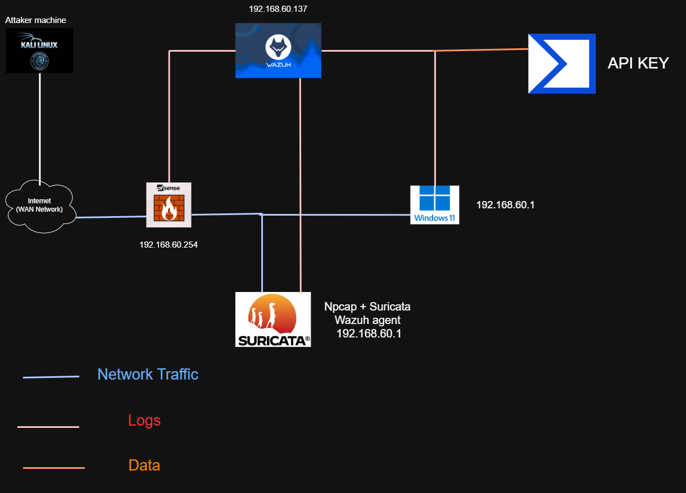

# SOC Home Lab — Lab structure and setup infrastructure

[TOC]

---

## 0. Executive Summary

**Lab objective:** Build a SOC home Lab using Wazuh (SIEM/XDR), Suricata (IDS/IPS), and pfSense (firewall/gateway) to practice detection engineering - writing custom decoders/rules, simulating attacks mapped to MITRE ATT&CK, and validating rules against real log evidence.

**Scope:**
- Baseline detection engineering: pfSense filterlog decoder, Suricata local rules, Sysmon/Windows Event Log mapping, VirusTotal threat intel integration.
- Full 12-stage attack simulation: Reconnaissance → Brute Force → Initial Access → Execution → Discovery → Payload Drop → Persistence → C2 → Credential Access → File Lifecycle → Cleanup/Anti-forensics → Exfiltration.
- Advanced correlation rules: linking brute force + successful login, LSASS access, log clearing.

**Overall status:** Most detections are confirmed by real log evidence. Several correlation-level rules (`100410`, `100411`, `100412`) and the exfiltration rule (`100413`) are still at the design stage / not fully verified with raw alerts — see Section 9.

---

## 1. Lab Architecture

The lab uses VMware VMs and includes the following components: 

| Component | Role |
|---|---|
| **Wazuh Server** | Runs the Wazuh manager, Indexer, and Dashboard. Collects & correlates logs from agents, Suricata, and pfSense |
| **Windows 11 Endpoint** | Runs the Wazuh Agent (system monitoring + log forwarding); the victim (target) machine |
| **Kali Linux (Attacker)** | Machine used to simulate attacks |
| **pfSense Firewall** | Provides firewall logs, integrated into Wazuh via syslog |
| **Suricata IDS/IPS** | Monitors network traffic, sends alerts to Wazuh based on custom rules |



### Wazuh Architecture
- **Wazuh Agent**: a lightweight program installed on each monitored device (Linux/Windows/macOS), collects security data and forwards it to the Wazuh Server.
- **Wazuh Server**: receives the data, decodes and analyzes it against rules, generates alerts, and forwards them to the **Wazuh Indexer**.
- **Wazuh Indexer**: a search/analytics engine (built on Elasticsearch/OpenSearch) that indexes data for fast querying.
- **Wazuh Dashboard**: a web interface (built on Kibana) — real-time monitoring, compliance tracking, and investigation.

Installation: https://documentation.wazuh.com/current/quickstart.html

### Wazuh Server Setup Configuration 
- **Network Mode:** NAT + Host-only (NAT for internet updates, Host-only for internal LAN communication).
- **Host Platform:** VMware
- **Target Agent OS:** Windows

### Wazuh Agent Setup Configuration
**Step 1:** Platform support
- Windows
- Linux
- macOS

**Step 2:** Deploying new Agent
- Visit the official Wazuh download page: https://documentation.wazuh.com/current/installation-guide/wazuh-agent/wazuh-agent-package-windows.html
- Download the Windows `.msi` installer for the Wazuh agent.
- Run the installer to begin the installation process.

**Step 3:** Agent settings configuration
- Navigate to the Endpoints tab.
- Click on **Deploy new agent**.
- Enter the Server Address — the IP address of your Wazuh Manager (`192.168.60.137`).
- Specify a unique Agent Name (e.g., `PC1`).
- Wazuh will generate registration commands. These commands must be executed in PowerShell to link the agent with the manager.
- Open Windows PowerShell as Administrator.
- Paste and execute the provided commands.

### IP / Role Table

| Component | IP Address | Role |
|---|---|---|
| Suricata IDS | (runs on Windows or Kali) | Host-based network IDS + IPS on pfSense |
| pfSense | 192.168.254.101 (WAN) / 192.168.60.254 (LAN) | Firewall/gateway (forwards logs via syslog) |
| Kali Linux | 192.168.254.100 (WAN) / 192.168.60.135 (LAN) | Attacker machine |
| Windows 11 | 192.168.60.1 | Wazuh agent (monitored endpoint) |
| Wazuh Server | 192.168.60.137 | Central SIEM (manager + indexer + dashboard) |

> ⚠️ **IP inconsistency note**: the source documents use `192.168.60.101` for the Windows11 endpoint in the baseline Detection Engineering section, but switch to `192.168.60.1` in the Full Attacking Chain section. The actual current IP of the Windows11 agent should be confirmed before reusing this report for a future test run.

---

## 2. pfSense Firewall Configuration

**Step 1: Requirements**
1. Virtual Machine Software → VMware Workstation Pro (used in this guide, but VirtualBox also works).
2. pfSense ISO → Download the latest version from the official pfSense website.
3. Wazuh Manager → Running and accessible in your lab environment.

**Step 2: Creating a Virtual Machine for pfSense**
1. Open VMware → Navigate to File → New Virtual Machine.
2. Select the Installation Media → Choose Installer disc image file (ISO) and browse for the downloaded pfSense ISO.
3. Name Your VM → Use a descriptive name such as `pfSense` and pick a save location.
4. Allocate Disk Space → 20 GB minimum (store as a single file recommended).
5. Customize Hardware:
   - RAM: 1GB minimum (2 GB recommended).
   - CPU: 1 vCPU (2 cores recommended).
   - Network Adapters: 
     - Adapter 1 (WAN) → NAT (simulates internet access).
     - Adapter 2 (LAN) → Host-only (isolated internal lab network).
6. Assign Interfaces:
   - WAN (em0) → Configured via DHCP (IP in `192.168.254.101/24` range).
   - LAN (em1) → Static IP `192.168.60.254/24`.

**Step 3: Accessing the pfSense Web Interface**
1. Open a browser from a VM (e.g., Kali Linux) connected to the LAN network.
2. Go to: `https://192.168.60.254/`
3. Log in with default credentials:
   - Username: `admin`
   - Password: `pfsense`

**Step 4: Why Combine pfSense with Wazuh?**
- pfSense acts as the network security gateway, generating logs on traffic, connections, and blocked events.
- Wazuh functions as the Security Information and Event Management (SIEM) platform, collecting and analyzing logs to detect suspicious activity.
==> Together, they form a mini SOC environment, where firewall events are monitored and correlated with endpoint activity.

**Step 5: Configuring pfSense Logs in Wazuh**
1. Enable Remote Logging in pfSense:
   - Go to Status → System Logs → Settings.
   - Check **Enable Remote Logging**.
   - Add your Wazuh server's IP (`192.168.60.137`) under Remote Syslog Servers.
   - Set Port to `514` (default syslog).
   - Select log categories to forward: System, Firewall, VPN, DHCP, DNS.
2. Configure Wazuh Server to receive Syslog:
   - On the Wazuh Server, open `/var/ossec/etc/ossec.conf`.
   - Add the following `<remote>` block to listen for pfSense logs:
     ```xml
     <remote>
       <connection>syslog</connection>
       <port>514</port>
       <protocol>udp</protocol>
       <allowed-ips>192.168.60.254</allowed-ips>
     </remote>
     ```
   - Restart the Wazuh Manager to apply changes:
     ```bash
     sudo systemctl restart wazuh-manager
     ```

---

## 3. Suricata IDS Configuration

**IDS vs IPS Overview**
1. **IDS (Intrusion Detection System):**
   - Detects threats by inspecting traffic using signatures, IoCs, or Lua scripting.
   - Generates alerts and logs but does not block traffic.
2. **IPS (Intrusion Prevention System):**
   - Takes proactive action by dropping or allowing traffic based on inspection results.

**Download and Install**
1. Visit: https://suricata.io/download/
2. Download the Windows installer (`.msi`).
3. Run the installer with default settings.
   - Suricata installs to: `C:\Program Files\Suricata\`
   - Contents include: `suricata.exe`, `suricata.yaml`, `rules\`, `log\`.

**Install and Verify Npcap**
Suricata requires Npcap to capture network traffic.
1. Download from https://npcap.com/#download.
2. During installation: Enable WinPcap API-compatible mode & Enable startup at boot.
3. Verify that Npcap is running via PowerShell:
   ```powershell
   Get-Service -Name npcap
   ```
   If not running: `Start-Service -Name npcap`

**Configure Suricata**

1. Open Configuration: `C:\Program Files\Suricata\suricata.yaml`

2. Define Network Interface. To view interfaces: `Get-NetAdapter | Select Name, Status`. Update `suricata.yaml`:
```yaml
af-packet:
   - interface: Wi-fi
```
3. Enable JSON Logging for EVE output:
```yaml
outputs:
	- eve-log:
		enabled: yes
		filetype: regular
		filename: eve.json
```
**Running Suricata**
In PowerShell (Admin):
We are using the Host-only network from the VMware machine (VMnet1) so our interface is: \Device\NPF_{B030E396-B937-4B1A-ADC6-B02699BCBC95}

```powershell
cd "C:\Program Files\Suricata\"
.\suricata.exe -c suricata.yaml -i "\Device\NPF_{B030E396-B937-4B1A-ADC6-B02699BCBC95}"
```
Important log files in C:\Program Files\Suricata\log\: `eve.json (JSON alerts)`, `fast.log`, `stats.log`.

**Integrate Suricata with Wazuh Agent**
To send Suricata alerts to the Wazuh Server, configure the local agent to read `eve.json`.

1. Open the Wazuh Agent configuration on the Windows endpoint: `C:\Program Files (x86)\ossec-agent\ossec.conf`

2. Add the following block:

```xml
<localfile>
  <log_format>json</log_format>
  <location>C:\Program Files\Suricata\log\eve.json</location>
</localfile>
```
3. Restart the Wazuh Agent service in PowerShell (Admin):
```powershell
Restart-Service -Name wazuh
```
4. VMware Virtual Machine Resources

| VM | vCPU | RAM | Network |
|---|---:|---:|---|
| Wazuh Server | 4 | 8 GB | NAT + Host-only |
| pfSense | 2 | 2 GB | NAT + Host-only |
| Kali Linux | 2 | 4 GB | Host-only |
| Windows 11 | 4 | 8 GB | Host-only |

5. Connectivity Validation

Verify connectivity between the lab components before configuring detection rules.

From Windows:

```powershell
ping 192.168.60.137
```
From kali
```powershell
ping 192.168.60.254
ping 192.168.60.137
ping <WINDOWS-IP>
```

6. Data Flow Validation
**Windows Endpoint**
`Windows Event Logs / Sysmon → Wazuh Agent → Wazuh Server → Wazuh Indexer → Wazuh Dashboard`

**Network Traffic**
`Network Traffic → Suricata → eve.json → Wazuh Agent → Wazuh Server → Wazuh Dashboard`

**Firewall Logs**
`pfSense → Syslog (UDP/514) → Wazuh Server → Wazuh Dashboard`

**Agent Connectivity Validation**
Verify the Wazuh agent status from:
`Wazuh Dashboard → Agents management → Summary`

The Windows endpoint should appear as Active after successful agent enrollment and connectivity.
