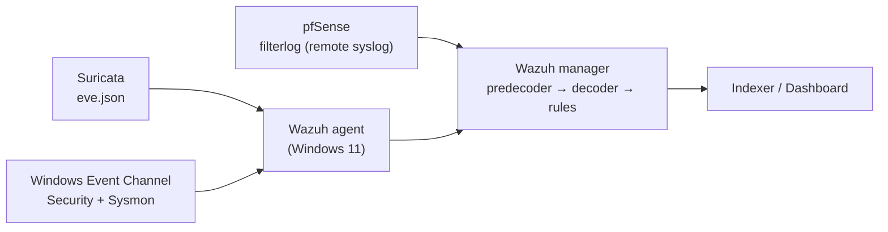

# 03 — Detection Engineering: Decoders & Rules

> Reference for every custom **decoder** and **rule** in the lab: **pfSense** (firewall), **Suricata** (network IDS) and **Sysmon / Windows Event Log** (endpoint).
> For each entry: *what it matches, why it is written that way, and where it can fail.*

**File origin**

| Type | File |
|---|---|
| Decoder (pfSense) | [`local_decoder.xml`](https://github.com/Khoavo-187/Wazuh-siem-home-lab/blob/main/siem-wazuh/custom-decoder/local_decoder.xml) |
| Wazuh rules (pfSense) | [`pfsense_rules.xml`](https://github.com/Khoavo-187/Wazuh-siem-home-lab/blob/main/siem-wazuh/custom-rules/pfsense_rules.xml) |
| Wazuh rules (Suricata wrappers) | [`suricata_rules.xml`](https://github.com/Khoavo-187/Wazuh-siem-home-lab/blob/main/siem-wazuh/custom-rules/suricata_rules.xml) |
| Wazuh rules (Sysmon & Windows events) | [`sysmon_rules.xml`](https://github.com/Khoavo-187/Wazuh-siem-home-lab/blob/main/siem-wazuh/custom-rules/sysmon_rules.xml) |
| Suricata rules | [`local.rules`](https://github.com/Khoavo-187/Wazuh-siem-home-lab/blob/main/network/Suricata_configuration/local.rules) |
| Suricata configuration | [`suricata.yaml`](https://github.com/Khoavo-187/Wazuh-siem-home-lab/blob/main/network/Suricata_configuration/suricata.yaml) |
| Sysmon configuration | [`sysmon_config.xml`](https://github.com/Khoavo-187/Wazuh-siem-home-lab/blob/main/endpoints/windows-11/sysmon_config.xml) (SwiftOnSecurity, source version 74) |
| Wazuh agent configuration | [`ossec.conf`](https://github.com/Khoavo-187/Wazuh-siem-home-lab/blob/main/endpoints/windows-11/ossec.conf) |

---

## 0. Overview

### 0.1 Data flow



| Source | Transport | Decoder | Parent rule |
|---|---|---|---|
| pfSense | Remote syslog to the manager (`192.168.60.137:514`, RFC 3164) | `pfsense-lab` + 5 child decoders (custom) | `100100` (custom) |
| Suricata (Windows endpoint) | `eve.json` → agent `localfile` (JSON) | Built-in JSON decoder | `86601` (built-in Suricata alert rule) |
| Sysmon / Security | Event Channel → agent | `windows_eventchannel` (built-in) | Built-in Sysmon / Windows rules (`sysmon_event*` groups, `60106`, `60117`, `60122`) |

### 0.2 ID ranges

| Wazuh rule IDs | Source | Content |
|---|---|---|
| `100100`–`100140` | pfSense | Base, block/pass, scan, burst |
| `100200`–`100201` | pfSense | ICMP, ping sweep |
| `100300`–`100307` | Suricata | Wrappers for sids `1000002`–`1000009` |
| `100400`–`100414` | Sysmon / Windows Security | Process, network, file, registry, credential, anti-forensics |
| `1000002`–`1000011` | Suricata **sids** (not Wazuh IDs) | Network-side detections |

### 0.3 Rule attributes used in this document

| Attribute | Meaning |
|---|---|
| `if_sid` / `if_group` | Child rule: evaluated only when the parent rule (or any rule of the group) matched **on the same event** |
| `if_matched_sid` + `frequency` / `timeframe` | Correlation: fires when the target rule matched ≥ N times within T seconds |
| `same_source_ip`, `same_field`, `different_*` | Events in a correlation chain must share (or differ in) the given field |
| `ignore` | After firing, mute the rule for N seconds |
| `options no_log` | Match for chaining/correlation only; no alert is generated |

> `frequency` thresholds follow Wazuh's counting and can be off by ±1 event from the figures quoted below.

---

## 1. pfSense

### 1.1 `filterlog` format

pfSense forwards firewall logs to the manager over syslog (`logall`, RFC 3164). The syslog header is not consistent: in some events the hostname is missing and Wazuh's predecoder puts `filterlog[pid]:` into the `hostname` field. That is why the parent decoder matches on the **message content** and not on `program_name`.

Sample line (IPv4 TCP):

```text
Aug  8 10:53:29 filterlog[63489]: 80,,,100000101,em1,match,pass,in,4,0x0,,128,33199,0,DF,6,tcp,52,192.168.60.101,162.159.197.3,61197,443,0,S,1576499639,,65535,,mss;nop;wscale;nop;nop;sackOK
```

| # | filterlog field | Example | Wazuh field |
|---|---|---|---|
| 1 | rule number | `80` | `pfsense.rulenum` |
| 2 | sub-rule | *(empty)* | skipped (the `,,,` in the regex) |
| 3 | anchor | *(empty)* | skipped |
| 4 | tracker | `100000101` | `pfsense.tracker` |
| 5 | interface | `em1` | `pfsense.interface` |
| 6 | reason | `match` | `pfsense.reason` |
| 7 | action | `pass` | **`action`** (static) |
| 8 | direction | `in` | `pfsense.direction` |
| 9 | IP version | `4` | `pfsense.ipversion` |
| 10 | TOS | `0x0` | `pfsense.tos` |
| 11 | ECN | *(empty)* | `pfsense.ecn` |
| 12 | TTL | `128` | `pfsense.ttl` |
| 13 | IP ID | `33199` | `pfsense.id` |
| 14 | fragment offset | `0` | `pfsense.offset` |
| 15 | IP flags | `DF` | `pfsense.flags` |
| 16 | protocol ID | `6` | `pfsense.protocol_number` |
| 17 | protocol text | `tcp` | **`protocol`** (static) |
| 18 | length | `52` | `pfsense.length` |
| 19 | source IP | `192.168.60.101` | **`srcip`** (static) |
| 20 | destination IP | `162.159.197.3` | **`dstip`** (static) |
| 21 | source port | `61197` | **`srcport`** (static) |
| 22 | destination port | `443` | **`dstport`** (static) |
| 23 | data length | `0` | `pfsense.data_length` |
| 24+ | TCP flags, seq, ack, window, options | `S,1576499639,…` | **not decoded** |

Bold fields are Wazuh *static fields*: rules can use them directly (`<action>`, `<protocol>`, `<same_source_ip/>`, `$(srcip)`). All other fields live under `data.pfsense.*`.

Interfaces seen in the lab logs: `em1` (LAN `192.168.60.0/24`), `em0` (WAN side `192.168.254.0/24`), `lo0` (loopback).

### 1.2 Decoder tree

```text
pfsense-lab                      (parent: recognises every filterlog line)
├── pfsense-lab-ports            IPv4 TCP / UDP
├── pfsense-lab-icmp             IPv4 ICMP
├── pfsense-lab-igmp             IPv4 IGMP
├── pfsense-lab-ipv4             IPv4, any other protocol (fallback)
└── pfsense-lab-ipv6             IPv6
```

| Decoder | Prematch (short) | Extra fields (beyond the common prefix) |
|---|---|---|
| `pfsense-lab` | `filterlog\[\d+\]:\s*` | none (parent only) |
| `pfsense-lab-ports` | IPv4 + `tcp` or `udp` | `srcport`, `dstport`, `pfsense.data_length` |
| `pfsense-lab-icmp` | IPv4 + `icmp` | `pfsense.icmp_type`, `pfsense.icmp_id`, `pfsense.icmp_seq` |
| `pfsense-lab-igmp` | IPv4 + `igmp` | none (stops at `dstip`) |
| `pfsense-lab-ipv4` | IPv4, protocol ∉ {tcp, udp, icmp, igmp} | none (stops at `dstip`) |
| `pfsense-lab-ipv6` | IPv6 (`,6,`) | `pfsense.class`, `pfsense.flowlabel`, `pfsense.hoplimit` |

#### `pfsense-lab` — parent
- PCRE2 prematch `filterlog\[\d+\]:\s*` finds `filterlog[<pid>]:` anywhere in the line.
- Children use `offset="after_parent"`: their regex starts **after** `filterlog[pid]: `, so the (variable) syslog header never needs to be parsed.

#### `pfsense-lab-ports` — IPv4 TCP / UDP
- Prematch: `\d+,,,.*?,4,.*?,(?:tcp|udp),` — rule number followed by `,,,` (empty sub-rule and anchor), version `4`, protocol `tcp` or `udp`.
- The regex has 21 capture groups mapped one-to-one to the 21 names in `<order>`.
- The `(tcp|udp)` group fills the static field `protocol`, which lets rule `100140` filter on `^tcp$`.
- UDP example: `76,,,1000002661,em0,match,pass,out,4,0x0,,63,4250,0,none,17,udp,64,192.168.254.101,8.8.8.8,20455,53,44` → `srcip=192.168.254.101`, `dstip=8.8.8.8`, `dstport=53`, `pfsense.data_length=44`.

#### `pfsense-lab-icmp` — IPv4 ICMP
- After `dstip`, an ICMP echo carries three fields: type (`request` / `reply`), id, sequence.
- Example: `74,,,1000002565,em1,match,pass,out,4,0x0,,64,40058,0,none,1,icmp,84,192.168.60.254,192.168.60.101,request,40169,064` → `pfsense.icmp_type=request`, `pfsense.icmp_id=40169`, `pfsense.icmp_seq=064`.

#### `pfsense-lab-igmp` — IPv4 IGMP
- Extracts up to `dstip` and ignores the options that follow. Purpose: multicast traffic (`224.0.0.x`) is decoded instead of falling through to the generic fallback.

#### `pfsense-lab-ipv4` — IPv4 fallback
- Catches every remaining IPv4 protocol (ESP, GRE, OSPF, …).
- The protocol group uses a negative lookahead `((?!(?:tcp|udp|icmp|igmp),)[^,]+)` to **exclude** the four protocols that already have a dedicated decoder, so the child decoders never overlap.

#### `pfsense-lab-ipv6` — IPv6
- Differences from IPv4: after the version come `class`, `flowlabel`, `hoplimit`, and the **protocol text comes before the protocol ID** (reverse of IPv4). The regex mirrors that with `([^,]+),(\d+)`.
- Extracts up to `srcip` / `dstip`; no ports.

#### Decoder limitations

| # | Limitation | Consequence |
|---|---|---|
| 1 | TCP flags (`S`, `SA`, `F`, …) are not extracted | SYN cannot be told apart from other packets; `100140` counts logged `pass` events rather than SYNs |
| 2 | The ICMP decoder only matches echo (`type,id,seq`) | Other ICMP types (unreachable, time-exceeded, …) use a different layout and would need their own decoder to get `srcip`/`dstip` — *confirm with `wazuh-logtest`* |
| 3 | `sub-rule` and `anchor` must be empty (`,,,`) | Events from rules inside an anchor are not decoded |
| 4 | No ports for IPv6 | IPv6 port scans are invisible |
| 5 | Loose prematch (`.*?,4,` can match by accident) | Harmless, because the regex that follows pins every position; anchoring with `^` would be a cheap optimisation |

### 1.3 pfSense rules

```text
filterlog ─► 100100 (base, no_log)
              ├─► 100101 block ──► 100102  ≥10 blocks / 60s, same source
              ├─► 100110 pass  ──► 100140  ≥15 connections / 10s, same src → dst:port (TCP)
              ├─► 100200 ICMP  ──► 100201  ≥8 ICMP / 30s, same source, many destinations
              └─► 100130  ≥15 events / 30s, same source, many different dst ports (any action)
```

| ID | Level | Condition | Correlation | MITRE |
|---|---|---|---|---|
| `100100` | 1 (`no_log`) | `decoded_as pfsense-lab` | none | none |
| `100101` | 5 | `action = block` | none | none |
| `100102` | 10 | rule `100101` | ≥10 / 60s, `same_source_ip`, `ignore 120` | T1046 |
| `100110` | 3 (`no_log`) | `action = pass` | none | none |
| `100130` | 10 | any `100100` event | ≥15 / 30s, `same_source_ip`, `different_dstport`, `ignore 120` | T1046 |
| `100140` | 6 | rule `100110` + `protocol = tcp` | ≥15 / 10s, same src, dst, dstport, `ignore 60` | none |
| `100200` | 7 | `protocol = icmp` | none | none |
| `100201` | 8 | rule `100200` | ≥8 / 30s, `same_source_ip`, `different_dstip`, `ignore 120` | T1018 |

#### `100100` — Firewall log detected (level 1, `no_log`)
Root of the whole pfSense tree. `no_log` keeps thousands of level-1 alerts out of the index, while the rule still serves as the parent for the `if_sid` / `if_matched_sid` rules below.

#### `100101` — Traffic blocked (level 5)
- `if_sid 100100` + `<action>block</action>` (`action` is the static field from column 7 of filterlog).
- One alert per blocked packet; the description carries the 5-tuple `$(srcip):$(srcport) -> $(dstip):$(dstport)`.
- Limitation: only `block` is matched; `reject` (pfSense answers with RST/ICMP) is not covered.

#### `100102` — Multiple firewall blocks (level 10)
- Correlation on `100101`: ≥10 packets blocked from the same `srcip` within 60s → scan or brute force against closed ports. Mapped to T1046.
- `ignore 120` mutes the rule for 120s after it fires.

#### `100110` — Traffic allowed (level 3, `no_log`)
Not meant to alert. It is the link that lets `100140` count allowed connections.

#### `100130` — Possible port scan, many destination ports (level 10)
- Correlation over **all** pfSense events (`100100`, pass and block): same `srcip`, ≥15 different `dstport` values within 30s. Mapped to T1046.
- Detects scans by **behaviour** (diversity of destination ports) instead of by action, so it still fires when ports are open and traffic is passed (where `100102` sees nothing).
- Limitation: an internal host legitimately reaching many services at once can cross the threshold.
- Lab trigger: `nmap -sS -p1-1000 <target>` from Kali.

#### `100200` — ICMP ping detected (level 7)
- `if_sid 100100` + `<protocol>^icmp$</protocol>`.
- Purpose: record pings and feed `100201`.
- Note: level 7 for **every** ICMP packet, including pfSense's own gateway monitoring → noisy. Consider level 3 (or `no_log`) and keep the alert at `100201`.

#### `100201` — Ping sweep (level 8)
- Correlation on `100200`: same `srcip`, ≥8 different `dstip` within 30s. Mapped to T1018 (Remote System Discovery).
- Lab trigger: `nmap -sn 192.168.60.0/24`.

#### `100140` — TCP connection burst (level 6)
- Correlation on `100110`: same `srcip`, `dstip`, `dstport`, `protocol = tcp`, ≥15 events within 10s.
- Meaning: flood or brute force against **one** service (e.g. SSH, RDP). pfSense is stateful and logs only the packet that creates the state, so the number of `pass` events approximates the number of new connections.
- "SYN burst" is only approximate, because TCP flags are not decoded (limitation #1).
- False positives: ordinary HTTPS bursts to a single CDN endpoint can reach the threshold. Exclude `80`/`443` or raise the threshold for well-known web destinations.

---

## 2. Suricata

### 2.1 Sensor and configuration

The rules and configuration published in this repo belong to the Suricata instance running on the **Windows 11 endpoint** (`default-rule-path: C:\Program Files\Suricata\rules\`). The second instance on the pfSense WAN interface is not part of the repo.

Settings in [`suricata.yaml`](https://github.com/Khoavo-187/Wazuh-siem-home-lab/blob/main/network/Suricata_configuration/suricata.yaml) that shape every rule below:

| Setting | Value | Effect |
|---|---|---|
| `HOME_NET` | `[192.168.60.0/24, !192.168.60.135]` | The whole LAN **except Kali** (`.135`) |
| `EXTERNAL_NET` | `!$HOME_NET` | In practice: Kali plus the Internet |
| `rule-files` | `local.rules` only | No Emerging Threats or other rule sets — every alert comes from the custom rules |
| `eve-log` | enabled (`alert`, `http`, `dns`, `tls`, `files`, …) → `eve.json` | `eve.json` is the file the Wazuh agent tails |

Why `HOME_NET` excludes Kali: with Kali inside `$HOME_NET`, rules written as `$HOME_NET → any` (reverse shell ports) fired on Nmap scans run **from** the attacker. Removing the attacker from `$HOME_NET` makes it an `$EXTERNAL_NET` source, so the inbound rules (`1000002`, `1000003`) fire on Kali and the outbound rules no longer fire on Kali's own traffic.

### 2.2 Rule inventory

| sid | Detection | Match | Wazuh rule | Level | MITRE |
|---|---|---|---|---|---|
| `1000002` | Port scan | SYNs from `$EXTERNAL_NET` to `$HOME_NET`, ≥15 in 10s per source | `100300` | 5 | T1595 |
| `1000003` | SSH attempts | SYNs to port 22, ≥5 in 60s per source | `100301` | 8 | T1110 |
| `1000004` | RDP attempt | SYNs to port 3389, ≥5 in 60s per source | `100302` | 6 | T1133 |
| `1000005` | SMB probe | SYNs to port 445, ≥5 in 60s per source | `100303` | 6 | T1046 |
| `1000006` | Reverse shell ports | Established outbound traffic to `4444, 1337, 31337, 5555` | `100304` | 12 | T1071 |
| `1000007` | curl user-agent | Any HTTP request whose User-Agent contains `curl` | `100305` | 5 | T1592 |
| `1000008` | EICAR download | HTTP response body contains the EICAR prefix | `100306` | 10 | T1105 |
| `1000009` | DNS test domain | DNS query for `malware-test.local` | `100307` | 9 | T1071.004 |
| `1000010` | Windows shell banner | Outbound payload contains the `cmd.exe` banner | **none** | — | T1071 |
| `1000011` | curl download of script/binary | `curl` user-agent + URI ending in `.sh/.ps1/.exe/.bat/.dll` | **none** | — | T1105 |

### 2.3 Anatomy of a rule (sid 1000002)

```text
alert tcp $EXTERNAL_NET any -> $HOME_NET any (
  msg:"LOCAL Possible Port Scan - Multiple SYN in short time";
  flow:to_server; flags:S;
  threshold:type both, track by_src, count 15, seconds 10;
  classtype:attempted-recon;
  metadata:mitre_tactic_id TA0043, mitre_technique_id T1595;
  sid:1000002; rev:3;)
```

| Part | Meaning |
|---|---|
| `alert tcp $EXTERNAL_NET any -> $HOME_NET any` | Action, protocol, source (address, port) → destination (address, port) |
| `flow:to_server` | Client-to-server direction only |
| `flags:S` | Exactly SYN — excludes SYN-ACK, so only connection **initiations** count |
| `threshold:type both, track by_src, count 15, seconds 10` | Alert once when a source reaches 15 matches within 10s, then stay quiet until the window ends |
| `classtype` | Category used for Suricata's priority and reporting |
| `metadata` | MITRE tags, carried into `eve.json` under `alert.metadata` |
| `sid` / `rev` | Rule identifier (local range ≥ 1,000,000) and revision |

### 2.4 Rule by rule

#### `1000002` — Possible port scan
Counts SYN-only packets: ≥15 from one source within 10s. Depends on `$EXTERNAL_NET` — only Kali (or the Internet) can trigger it. Trigger: `nmap -sS <target>` from Kali.

#### `1000003` — Repeated SSH connection attempts
Same idea, destination port 22, lower threshold (5 per 60s). It counts **connection attempts**, not failed logins, so it fits brute-force tooling such as Hydra. Mapped to T1110.

#### `1000004` — RDP connection attempt
Source is `any`, so internal hosts are covered too. Counts SYNs to 3389 (≥5 per 60s). Mapped to T1133 (External Remote Services).

#### `1000005` — SMB port probe
Same pattern on port 445. The metadata pairs T1046 (Network Service Discovery) with `TA0043`, but T1046 belongs to **Discovery (TA0007)**, not Reconnaissance — fix the tactic ID.

#### `1000006` — Possible reverse shell, suspicious outbound port
- Source `$HOME_NET` → any, ports `4444` (Metasploit default), `1337`, `31337`, `5555`.
- Revision 3 replaced `flags:S` with `flow:to_server,established`, so only connections that completed the handshake match. This removed the false positives caused by Nmap SYN scans (a half-open probe never reaches `established`).
- Side effect: without a `threshold`, every packet of the established flow can alert. Add `threshold:type limit, track by_dst, count 1, seconds 60` to get one alert per flow window.
- Port lists are easy to evade (see *Behaviour over signatures* in the README); `1000010` complements it.

#### `1000007` — Recon tool user-agent (curl)
Matches `curl` in the HTTP User-Agent for any source and destination. Low fidelity: `curl` is also a legitimate admin and developer tool, so treat the alert as context, not a verdict.

#### `1000008` — EICAR test file over HTTP
`file_data` inspects the HTTP response body; the content match `X5O!P%@AP[4` is the beginning of the standard EICAR string. Direction `to_client` towards `$HOME_NET` means a host in the lab **downloaded** the file. HTTP only: HTTPS bodies are not visible.

#### `1000009` — DNS query to suspicious test domain
`dns.query` buffer, `nocase` match on `malware-test.local`. It is a lab marker for the C2-over-DNS pattern (T1071.004), not a real indicator. It sees only DNS that crosses the sensor.

#### `1000010` — Reverse shell banner (Windows)
- Behavioural rule: matches the banner a Windows `cmd.exe` prints when a shell starts (`Microsoft Windows [Version …]` followed within 100 bytes by `(c) Microsoft Corporation`), sent **outbound** on an established connection, on **any port** (so it still works when the shell uses 80 or 443).
- Limits: plain-text traffic only; matches the `cmd.exe` banner, not the PowerShell one (`Windows PowerShell` / `Copyright (C)`), even though the message says "CMD/Powershell"; a reverse shell that prints no banner is not seen.

#### `1000011` — Suspicious download via curl
`curl` user-agent plus a URI ending in `.sh`, `.ps1`, `.exe`, `.bat` or `.dll`, from `$HOME_NET` to `$EXTERNAL_NET` (in the lab: the endpoint pulling a payload from Kali). The `$` anchor means a trailing query string (`?x=1`) defeats the match. It overlaps with `1000007`, so one request can raise both alerts.

### 2.5 Wazuh wrapper rules

Every wrapper has the same shape:

```xml
<rule id="100300" level="5">
  <if_sid>86601</if_sid>
  <field name="alert.signature_id">1000002</field>
  <description>Suricata: Possible Port Scan from $(src_ip)</description>
  <mitre><id>T1595</id></mitre>
  <group>recon,network_scan</group>
</rule>
```

- `86601` is Wazuh's built-in parent for Suricata `alert` events; the wrapper narrows it to a single `alert.signature_id`.
- `$(src_ip)` and `$(dest_port)` come from the JSON fields of `eve.json`.
- Level and MITRE ID are assigned here (not in Suricata), so severity can be tuned without touching the sensor.
- The `field` value is a pattern match, not an equality test. Anchor it (`^1000002$`) so a future sid such as `10000021` cannot match by accident.

#### Gap: sids `1000010` and `1000011` have no wrapper
Their alerts only reach the generic built-in rule at its default level. Proposed wrappers (not yet deployed):

```xml
<rule id="100308" level="12">
  <if_sid>86601</if_sid>
  <field name="alert.signature_id">^1000010$</field>
  <description>Suricata: Windows shell banner sent outbound - possible reverse shell from $(src_ip) to $(dest_ip):$(dest_port)</description>
  <mitre><id>T1071</id></mitre>
  <group>command_and_control,reverse_shell</group>
</rule>

<rule id="100309" level="8">
  <if_sid>86601</if_sid>
  <field name="alert.signature_id">^1000011$</field>
  <description>Suricata: curl download of script or executable from $(src_ip)</description>
  <mitre><id>T1105</id></mitre>
  <group>command_and_control,download_execution</group>
</rule>
```

---

## 3. Sysmon & Windows Security events

### 3.1 Telemetry requirements

A Wazuh rule can only fire if the event exists. The Sysmon configuration is [`sysmon_config.xml`](https://github.com/Khoavo-187/Wazuh-siem-home-lab/blob/main/endpoints/windows-11/sysmon_config.xml) (SwiftOnSecurity, source version 74, Sysmon 13+). The agent ships the `Microsoft-Windows-Sysmon/Operational`, `Security`, `System` and `Application` channels (see [`ossec.conf`](https://github.com/Khoavo-187/Wazuh-siem-home-lab/blob/main/endpoints/windows-11/ossec.conf)).

| Event | Used by | What `sysmon_config.xml` does | Effect on the rules |
|---|---|---|---|
| **1** ProcessCreate | `100400`–`100403`, `100407` | `onmatch="exclude"`: everything is logged except the listed noise | Covered |
| **3** NetworkConnect | `100404`, `100413`, `100414` | Include list: specific images (`powershell.exe`, `cmd.exe`, `certutil.exe`, `bitsadmin.exe`, `nc.exe`, …), any binary under `C:\Users`, `C:\ProgramData`, `C:\Windows\Temp`, and a port list (22, 3389, 4444, 5900, …). Excludes Defender, Teams, `*.microsoft.com`, loopback | `100404` and `100414` are covered because PowerShell / cmd / certutil are included. `100413` (port 4445) is logged only when the process matches the include list — port 4445 itself is **not** in the list |
| **10** ProcessAccess | `100411` | The `include` section is **empty** — the file's own comment says an empty include logs nothing | **Rule cannot fire** until filters are added (see §5, item 1) |
| **11** FileCreate | `100405` | Include by extension and folder (`.exe`, `.dll`, `.ps1`, `.bat`, `\Downloads\`, `\Startup\`, …); no generic `\Temp\` or `\AppData\Roaming\` filter | The rule only sees files already selected by extension/folder, so in practice it flags **executables and scripts** written to Temp or Roaming |
| **13** RegistryEvent | `100406` | Includes `CurrentVersion\Run` (covers `Run`, `RunOnce`, …) | Covered |
| Security **4625 / 4624 / 1102** | `100408`, `100410`, `100412` | Not Sysmon — Windows Security log | Needs the `Security` channel (present) and the matching audit policy |

> SwiftOnSecurity's `name=` tags use the legacy technique IDs of 2021 (for example `T1060`, today `T1547.001`). Use the MITRE IDs from the Wazuh rules, not those tags.

### 3.2 Field names

Wazuh's `windows_eventchannel` decoder exposes Sysmon and Security data under `win.eventdata.*` and `win.system.*` with a lower-case first letter: `parentImage`, `image`, `commandLine`, `user`, `targetFilename`, `targetObject`, `destinationIp`, `destinationPort`, `sourceImage`, `targetImage`, `ipAddress`, and `win.system.eventID`.

The rules chain on built-in groups whose names are not consistent (`sysmon_event1`, `sysmon_event3`, but `sysmon_event_10`, `sysmon_event_11`, `sysmon_event_13`). Verify them against your Wazuh version (see §6).

### 3.3 Rules

| ID | Level | Trigger | Correlation | MITRE |
|---|---|---|---|---|
| `100400` | 5 | EID 1, `parentImage` ends with `powershell.exe` | none | none |
| `100401` | 10 | Child of `100400`, command line contains `-e`, `-enc` or `-encodedcommand` | none | T1027, T1059.001 |
| `100402` | 6 | EID 1, image `whoami`, `systeminfo`, `tasklist` or `nltest` | none | T1033, T1082 |
| `100403` | 8 | EID 1, image `certutil` or `bitsadmin` | none | T1105 |
| `100404` | 7 | EID 3, image `powershell` or `cmd` | none | T1071 |
| `100405` | 7 | EID 11, path contains `\Temp\` or `\AppData\Roaming\` | none | T1105 |
| `100406` | 10 | EID 13, key `…\CurrentVersion\Run` or `RunOnce` | none | T1547.001 |
| `100407` | 12 | Rule `100402` | ≥3 / 120s, `same_field` user | T1087 |
| `100408` | 10 | Rule `60122` (event 4625) with `ipAddress` ≠ `-` | ≥5 / 60s, `same_field` `ipAddress`, `ignore 120` | T1110 |
| `100410` | 13 | Logon success `4624` (`60106`) after `100408` | `same_field` `ipAddress` | T1110, T1078 |
| `100411` | 14 | EID 10, `targetImage` ends with `lsass.exe`, source not `taskmgr`/`svchost`/`MsMpEng` | none | T1003.001 |
| `100412` | 15 | Parent `60117`, `eventID = 1102` | none | T1070.001 |
| `100413` | 12 | EID 3, destination port `4445` | none | T1041 |
| `100414` | 12 | EID 3, image `powershell` or `certutil`, port `80` or `443` | none | T1041, T1105 |

#### `100400` — PowerShell spawned a process (level 5)
`if_group sysmon_event1` plus a PCRE2 match on `parentImage` (`(?i)powershell\.exe$`). The description shows parent, child, command line and user, which gives the process lineage in one line. It is the **parent** of `100401`. Scheduled tasks and management agents that wrap PowerShell also trigger it, so keep it at a low level.

#### `100401` — Encoded PowerShell command (level 10)
Child of `100400`; the command line must match `(?i)(?:^|\s)-(?:enc|encodedcommand|e)(?:\s|$)`. Encoding hides the payload from simple string detection (T1027) while running PowerShell (T1059.001).
Limits: (1) it only fires when the process was **started by PowerShell** (because of the `100400` parent), so `cmd.exe → powershell -enc …` or `explorer.exe → powershell -enc …` is missed; (2) PowerShell accepts abbreviations such as `-ec` and `-en`, which the regex does not cover. See §5, item 3 for an independent version.

#### `100402` — Reconnaissance binary (level 6)
EID 1 where `image` ends with `whoami`, `systeminfo`, `tasklist` or `nltest`. These are standard discovery tools (T1033 system owner, T1082 system information). Individually they are normal admin activity, hence the low level and the correlation in `100407`.

#### `100403` — LOLBin download/decode (level 8)
EID 1 for `certutil.exe` or `bitsadmin.exe`, both able to fetch or decode files (T1105). The rule does not inspect arguments, so legitimate certificate operations also match. Adding a command-line filter (`urlcache`, `-decode`, `/transfer`) would raise precision.

#### `100404` — Outbound connection from PowerShell / cmd (level 7)
EID 3 where the image is `powershell.exe` or `cmd.exe`. Shells rarely need direct network access, so any connection is worth a look (T1071). `sysmon_config.xml` includes these images, so the event is available for any destination port.

#### `100405` — File created in a sensitive path (level 7)
EID 11 with `targetFilename` containing `\Temp\` or `\AppData\Roaming\`. As explained in §3.1, Sysmon only logs executable/script extensions and a few folders, so the effective detection is *"executable or script dropped into Temp/Roaming"* (T1105).

#### `100406` — Registry Run key persistence (level 10)
EID 13 with `targetObject` matching `(?i)\\CurrentVersion\\(?:Run|RunOnce)(?:\\|$)` (T1547.001). Covers both HKLM and HKCU. Other autostart locations (`Winlogon`, `Policies\Explorer\Run`, services) are logged by Sysmon but not matched by this rule.

#### `100407` — Multiple reconnaissance commands (level 12)
Correlation on `100402`: ≥3 recon binaries from the same `win.eventdata.user` within 120s. A single `whoami` is routine; a burst of discovery commands is **active enumeration** (T1087). It depends on `100402` actually being the rule that fires for those events (see precedence note, §5 item 2).

#### `100408` — Failed logon burst (level 10)
Correlation on rule `60122` (failed logon, event 4625): ≥5 failures from the same `ipAddress` within 60s. Entries with `ipAddress` equal to `-` (local logons without a source address) are excluded by a negated field match. Mapped to T1110. It fits network logons (RDP, SMB, OpenSSH for Windows).

#### `100410` — Successful logon after a failed-logon burst (level 13)
Fires when a **4624** (`60106`) arrives from an `ipAddress` that previously triggered `100408`. This ordering — many failures followed by a success — is the classic pattern of a guessed password (T1110 → T1078). It has no explicit `frequency`/`timeframe`, so the correlation window falls back to Wazuh's default. Set it explicitly (§5, item 5).

#### `100411` — LSASS memory access (level 14)
EID 10 where `targetImage` ends with `lsass.exe` and `sourceImage` is **not** `taskmgr`, `svchost` or `MsMpEng` (negated field match, the allow-list). It targets credential dumping (T1003.001). **With the current `sysmon_config.xml` no EID 10 is logged, so this rule cannot fire.** Expect further allow-list entries (system processes, EDR, hypervisor tools) once the event is enabled.

#### `100412` — Security log cleared (level 15)
Parent `60117` plus `win.system.eventID = 1102` (audit log cleared). Clearing the log is anti-forensics (T1070.001), hence the highest level in the set. Confirm that `60117` is an ancestor of Security 1102 events in your Wazuh version; the built-in ruleset has its own rule for the same event.

#### `100413` — Connection to port 4445 (level 12)
EID 3 with `destinationPort` equal to `4445`. This is a **lab-specific indicator** for the exfiltration stage (T1041). As the README notes (*Behavior > signatures*), a hard-coded port is easy to change; `100404` and `100414` cover the behaviour. In addition, EID 3 for this port is only logged when the process matches the Sysmon include list.

#### `100414` — PowerShell / certutil on web ports (level 12)
EID 3 where the image is `powershell.exe` or `certutil.exe` and the port is 80 or 443. Standard web ports blend into normal traffic; a scripting engine or LOLBin using them is the signal (T1041, T1105). Expect some noise from legitimate scripts; baseline and exclude known destinations.

### 3.4 Correlation chains

```text
Brute force → compromise
  4625 ─► 60122 ─► 100408  (≥5 failures / 60s, same ipAddress)
                         └─► 4624 (60106) from same ipAddress ─► 100410  (level 13)

Active enumeration
  EID 1: whoami / systeminfo / tasklist / nltest ─► 100402 ─► 100407  (≥3 / 120s, same user)

PowerShell lineage
  EID 1: parent powershell.exe ─► 100400 ─► 100401  (encoded command)
```

---

## 4. MITRE ATT&CK coverage

| Tactic | Technique | Rules |
|---|---|---|
| Reconnaissance | T1595 Active Scanning | `100300` (sid `1000002`) |
| Reconnaissance | T1592 Gather Victim Host Information | `100305` (sid `1000007`) |
| Discovery | T1046 Network Service Discovery | `100102`, `100130`, `100303` |
| Discovery | T1018 Remote System Discovery | `100201` |
| Discovery | T1033 / T1082 / T1087 | `100402`, `100407` |
| Initial Access | T1133 External Remote Services | `100302` |
| Initial Access / Defense Evasion | T1078 Valid Accounts | `100410` |
| Credential Access | T1110 Brute Force | `100301`, `100408`, `100410` |
| Credential Access | T1003.001 LSASS Memory | `100411` |
| Execution | T1059.001 PowerShell | `100401` |
| Defense Evasion | T1027 Obfuscated Files or Information | `100401` |
| Defense Evasion | T1070.001 Clear Windows Event Logs | `100412` |
| Persistence | T1547.001 Registry Run Keys | `100406` |
| Command and Control | T1071 / T1071.004 | `100304`, `100307`, `100404`, sid `1000010` |
| Command and Control | T1105 Ingress Tool Transfer | `100306`, `100403`, `100405`, `100414`, sid `1000011` |
| Exfiltration | T1041 Exfiltration Over C2 Channel | `100413`, `100414` |

---

## 5. Known issues and recommendations

Ordered by impact. Items marked *hypothesis* need confirmation with `wazuh-logtest` (§6).

| # | Issue | Impact | Recommendation |
|---|---|---|---|
| 1 | **EID 10 is not logged** by `sysmon_config.xml` (empty `ProcessAccess` include) | `100411` can never fire | Add an include filter, then reload with `sysmon64.exe -c sysmon_config.xml` (snippet below) |
| 2 | **Rule precedence** *(hypothesis)*: when several sibling rules (same parent) match one event, Wazuh reports a single rule, and built-in rules are loaded before `/var/ossec/etc/rules/`. The README already records that some custom rules were "silently overridden by the default ruleset" | A custom rule can be shadowed by a built-in one for the same event (candidates: `100402`, `100406`, `100412`). Within the file, `100404` precedes `100413` and `100414` under the same group, so it may shadow them | Check each rule in `wazuh-logtest`; put specific rules before generic ones, or chain with `if_sid` on the built-in rule that wins |
| 3 | `100401` is a child of `100400` | Only catches `powershell -enc` started **by PowerShell** | Make it independent (snippet below) and widen the switch regex |
| 4 | sids `1000010` and `1000011` have no Wazuh wrapper | Their alerts are not classified or scored | Add `100308` / `100309` (§2.5) |
| 5 | `100410` has no explicit `frequency` / `timeframe` | Correlation window is implicit | Add `frequency="1"` and an explicit `timeframe` (for example 300) |
| 6 | `1000006` alerts on every packet of an established flow | Alert flood | Add `threshold:type limit, track by_dst, count 1, seconds 60` |
| 7 | `1000005` pairs T1046 with tactic `TA0043` | Wrong tactic in metadata | Use `TA0007` (Discovery) |
| 8 | Multi-line PCRE2 values inside `<field>` (whitespace and newlines around the pattern) | Depends on how the XML parser trims content | Write each pattern on one line and re-test after any reformatting |
| 9 | `ossec.conf` declares `eve.json` three times | Possible duplicate events and agent warnings | Keep one `localfile` block |
| 10 | `100200` (level 7) alerts on every ICMP packet; `100140` can reach its threshold on normal HTTPS bursts | Noise | Lower `100200`; exclude `80`/`443` or raise the threshold on `100140` |
| 11 | `100413` hard-codes port 4445 | Blind spot if the port changes | Keep as a lab marker; rely on `100404` / `100414` for behaviour |

**Snippet for item 1** — add to `sysmon_config.xml`, replacing the empty `ProcessAccess` block:

```xml
<ProcessAccess onmatch="include">
  <TargetImage name="LSASS access" condition="end with">\lsass.exe</TargetImage>
</ProcessAccess>
```

**Snippet for item 3** — independent version of `100401` (proposed, not yet deployed):

```xml
<rule id="100401" level="10">
  <if_group>sysmon_event1</if_group>
  <field name="win.eventdata.image" type="pcre2">(?i)powershell\.exe$</field>
  <field name="win.eventdata.commandLine" type="pcre2">(?i)(?:^|\s)[-/](?:e|ec|en[a-z]*)\s+\S{20,}</field>
  <description>Sysmon: Encoded PowerShell command from $(win.eventdata.user)</description>
  <mitre><id>T1027</id><id>T1059.001</id></mitre>
  <group>obfuscation,suspicious_powershell</group>
</rule>
```

---

## 6. Validation

```bash
# Syntax check of decoders and rules (run after every edit)
sudo /var/ossec/bin/wazuh-analysisd -t

# Interactive test: paste a raw log line and read the phases (decoder, rule)
sudo /var/ossec/bin/wazuh-logtest

# Confirm the built-in Sysmon group names in this Wazuh version
sudo grep -rl "sysmon_event_11" /var/ossec/ruleset/rules/
```

```powershell
# Which Sysmon event IDs are actually being produced?
Get-WinEvent -LogName "Microsoft-Windows-Sysmon/Operational" -MaxEvents 500 |
  Group-Object Id | Sort-Object Name | Select-Object Name, Count

# Configuration Sysmon is running right now (it can differ from the file in the repo)
sysmon64.exe -c
```

Quick lab triggers (isolated lab VM only):

| Rule | Trigger |
|---|---|
| `100401` | From a PowerShell window: `$e=[Convert]::ToBase64String([Text.Encoding]::Unicode.GetBytes('whoami')); powershell -enc $e` |
| `100402` / `100407` | `whoami`, `systeminfo`, `tasklist` within 120 seconds |
| `100403` | `certutil -urlcache -f http://<kali>/test.txt test.txt` |
| `100406` | `reg add HKCU\Software\Microsoft\Windows\CurrentVersion\Run /v LabTest /t REG_SZ /d calc.exe /f` (remove with `reg delete`) |
| `100408` / `100410` | 5 wrong passwords from Kali against RDP or SSH, then one correct login |
| `100412` | `wevtutil cl Security` (clears the log on the VM) |

Raw-log evidence for each rule (alert JSON, screenshots) belongs in the threat-emulation report.

---
